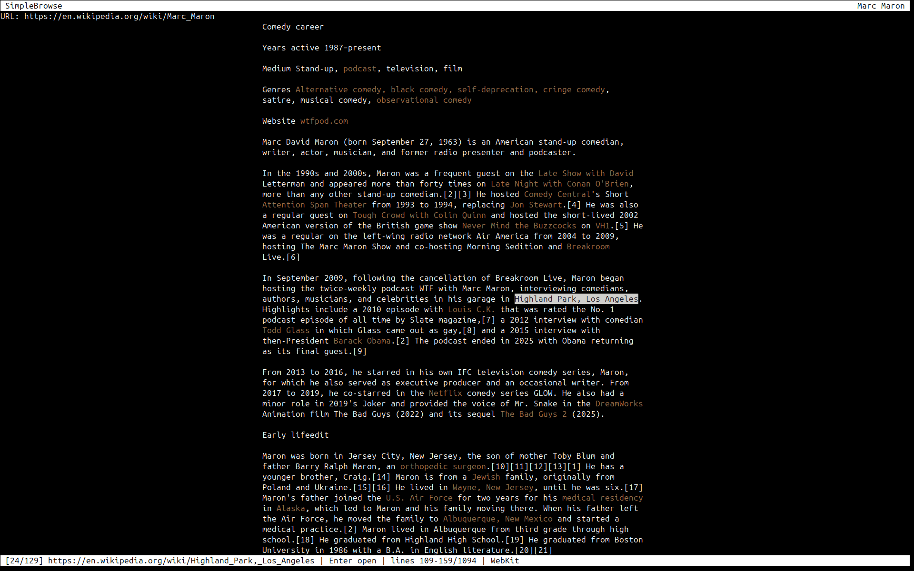

# SimpleSuite

SimpleSuite is a collection of lightweight terminal applications written in C
and ncurses. It is meant to provide a complete local-first workspace without a
database or desktop shell dependency.

## Applications

| Program | Purpose |
| --- | --- |
| `simplefiles` | File manager |
| `simplemail` | Local Maildir mail client |
| `simplewords` | Text editor / word processor |
| `simplecal` | Offline calendar and reminder app |
| `simpleclock` | Clock, stopwatch, timer, and alarm |
| `simpleflac` | Local audio player |
| `simpleradio` | Internet radio player |
| `simplepod` | Podcast search, episode browser, and player |
| `simplenews` | RSS and Atom reader |
| `simplebrowse` | Text-mode HTTP/HTTPS web browser |
| `simplepdf` | PDF/EPUB text reader |
| `simplevis` | Audio visualizer |
| `simplestats` | System monitor |
| `simplever` | Git frontend |
| `simplegame` | Small terminal arcade game |

## Installation

```sh
git clone https://github.com/kjwat/simplesuite.git
cd simplesuite
./checkdeps.sh
./build.sh
```

`build.sh` runs `make install`, installing programs into `~/.local/bin` and the
SimpleCal alarm asset into:

```text
~/.local/share/simplesuite/simplecal-alarm.mp3
```

It also creates SimpleNews example files and a SimpleMail config file if they
do not already exist.

If commands such as `simplewords` are not found after installation, add
`~/.local/bin` to your PATH:

```sh
echo 'export PATH="$HOME/.local/bin:$PATH"' >> ~/.bashrc
source ~/.bashrc
```

For zsh:

```sh
echo 'export PATH="$HOME/.local/bin:$PATH"' >> ~/.zshrc
source ~/.zshrc
```

See [DEPENDENCIES.md](DEPENDENCIES.md) for required build packages and optional
runtime features.

## Notes

- The default build installs all programs listed above.
- `simplepod`, `simplenews`, and `simplebrowse` require libcurl at build time.
- `simplebrowse` v4 keeps its fast static reader path, can use WebKitGTK
  through `` for JavaScript-required pages, and treats
  forms as navigable terminal controls.
- Pressing Enter on a direct audio, video, image, PDF, or EPUB link downloads
  it to the browser cache and opens it with the system MIME application.
- Shift-Enter on a direct file link opens an editable Save As path in the
  footer, defaulting to the original filename under `~/Downloads`.
- Audio programs require `mpv` for normal playback.
- `simplecal` and `simpleclock` use the installed alarm MP3 and try `mpv`
  first, with fallback players where supported.
- `simplepdf` uses `pdftotext` for PDF text extraction and `pandoc` for EPUB
  support.
- `simplefiles` configuration options are documented in
  `simplefiles-config.example`.
- `simplemail` reads local Maildir folders and uses configured external
  commands, normally `mbsync` for mail sync and `msmtp` for sending.
- `simplenews` defaults to `links %u` as its external browser command.
- Most tools store data under `~/.config`, `~/.local/share`,
  `~/.local/state`, or `~/.cache`.

<p align="center">
  
  
</p>

<p align="center">
  
  
</p>

<p align="center">
  
  
</p>

<p align="center">
  
  
</p>

<p align="center">
  
  
</p>

<p align="center">
  
  
</p>

<p align="center">
  
  
</p>

<p align="center">
  
</p>

## Keybindings

### simplefiles

- Arrows or `hjkl`: move; `l`, Right, or Enter opens; `h` or Left goes up.
- Page Up/Page Down: jump through the list.
- `Space`: toggle selection and advance.
- `v`: select all / clear all toggle; `V`: invert selection.
- `yy`: copy/yank; `dd`: cut; `dD`: trash/delete; `pp`: paste.
- Paste operations run in the background; the status bar reports completion.
- `cw`: rename current entry; `a`: make directory.
- `/`: search; `n`/`N`: next/previous match; `.`: toggle hidden files.
- `:`: command mode; `o`: open with application; `t`: shell here; `q`: quit.

### simplemail

- Arrows: move; Page Up/Page Down: jump through the message list.
- Enter opens a thread or message; Backspace returns from read/thread views.
- `m`: open mailbox chooser; `m` again closes it.
- Mailboxes are Inbox, Sent, Drafts, Archive, and Trash by default.
- `c`: compose new message.
- `r`: reply to the current message.
- `p` or `P`: run the configured sync command in the background.
- `Space`: toggle selection and advance.
- `v`: select all messages; `V`: invert selection; Esc clears selection.
- `a`: archive the current message or selection.
- `dD`: start delete/trash confirmation; `y` confirms.
- `u`: restore from Trash or Archive.
- `o`: open attachment; `s`: save attachment.
- `/`: search; `n`/`N`: next/previous match.
- `q`: confirm and quit.

### simplewords

- Startup behavior:
  - `words filename` opens or resumes that document, recovering a newer
    autosave if present.
  - `words` resumes the previous writing session, named or untitled.
  - `Ctrl-X b` starts a new blank document and makes that the next session.
- Arrows and Page Up/Page Down navigate.
- Shift plus arrows/Page Up/Page Down extends selection where the terminal
  reports modified keys.
- `Ctrl-X Ctrl-F`: open; `Ctrl-X b`: new blank document.
- `Ctrl-X Ctrl-S`: save; `Ctrl-X Ctrl-W`: save as.
- `Ctrl-X Ctrl-C`: quit.
- `Ctrl-S`: find text; `n`/`N`: next/previous match.
- `Ctrl-X u`: undo; `Ctrl-X r` or `Ctrl-R`: redo.
- `Ctrl-X Ctrl-Z`: focus mode.
- `Alt-W`: copy selection; `Ctrl-W`: cut; `Ctrl-Y`: paste.

### simplecal

Top-level month view:

- Month grid and agenda are sibling focus areas.
- Tab or Shift-Tab switches focus between the month grid and agenda.
- In month-grid focus, arrows move by day or week.
- In agenda focus, Up/Down moves through events and Left/Right changes day.
- Page Up/Page Down: previous/next month.
- `Home` or `t`: today.
- `y`: year view; `m`: month view.
- Enter from the month grid focuses the agenda.
- Enter from the agenda opens the selected event detail.
- Backspace at top level only moves agenda focus back to the month grid.
- `a`: create an event for the selected day.
- `e`: edit the selected agenda or search event.
- `d`: delete the selected agenda or search event; `D` confirms the first
  delete prompt.
- `/`: search events.
- `c`: clear ringing reminders.
- `?`: help.
- `q`: quit from the top-level month/year view.

Event card:

- Event detail is read-only until edited.
- In read-only detail, `e` edits; Esc or Backspace returns to the agenda.
- In create/edit mode, Tab, Shift-Tab, Up, and Down move between fields.
- Enter moves to the next field; on the Reminder row it opens the reminder
  card.
- Backspace edits text only; it does not save, cancel, or leave the card.
- Esc cancels edits and returns one level up.
- `Ctrl-S` saves and returns to the agenda.

Reminder card:

- Up/Down or Tab/Shift-Tab moves through alert and repeat choices.
- Enter or Space selects the highlighted choice.
- `Ctrl-S` applies the reminder choices back to the event edit card.
- Esc or Backspace cancels reminder-card changes.

Recurring delete:

- Deleting a recurring event prompts for `this occurrence`, `whole series`, or
  `cancel`.
- Esc or Backspace cancels that prompt.

### simpleflac

- `simpleflac PATH` opens a track, cue sheet, playlist, or directory directly.
- Up/Down or `j`/`k`: select; Enter: open/play; Backspace: go up.
- `Space`: pause.
- `c`: playlist/mode action shown in the footer.
- `p`: add to playlist/queue.
- Left/Right: previous/next track.
- `r`: random on/off.
- Page Up/Page Down: volume up/down.
- `q`: quit.

### simpleradio

- Up/Down or `j`/`k`: select; Enter: open/play; Backspace: go up.
- `Space`: pause.
- `c`: toggle auto-next/stay mode.
- Page Up/Page Down: volume up/down.
- `q` or Esc: quit.

### simplepod

- Up/Down: select; Enter: open a show or play an episode.
- `s`: podcast search.
- `f`: find in the visible list; `n`/`N`: next/previous match.
- Left/Right: seek -15/+30 seconds.
- Page Up/Page Down: volume up/down.
- `r`: resume selected episode when resume data is available.
- `Space`: pause.
- `b` or Backspace: go back.
- `q`: quit.

### simplenews

- Up/Down or `j`/`k`: move.
- Enter opens a feed, article list item, or article.
- Backspace, Left, or `h`: go back.
- `p`: pull/refresh all feeds in the background.
- `R`: refresh the current feed.
- `o`: open the selected article in the configured browser.
- `i`: show or hide failed feeds.
- `g`/`G`: top/bottom.
- `q`: quit.

### simplebrowse

- `simplebrowse --js URL`: load a page through WebKitGTK JavaScript mode.
- `simplebrowse --dump URL`: print cleaned page text; automatically retries
  likely JavaScript shells with JS mode when available.
- `simplebrowse --dump-js URL`: print cleaned page text after JavaScript.
- `simplebrowse --dump-links URL`: print the computed visible link navigation
  list with rendered line/column bounds.
- `simplebrowse --dump-links-js URL`: print the link list after JavaScript.
- `simplebrowse --clear-cache`: remove cached page snapshots from
  `$XDG_CACHE_HOME/simplebrowse/pages` or `~/.cache/simplebrowse/pages`.
- Ctrl-L: focus the URL bar.
- Enter: load the URL bar, open the selected link, edit the selected field, or
  submit the selected form button.
- Digits then Enter: open or activate the numbered visible link/field group.
- Page Down/Page Up: next/previous visible link or form control, jumping screens as
  needed.
- Space: toggle a selected checkbox/radio button; otherwise page down.
- `j`/`k`: scroll line by line.
- Up/Down, `b`, or Space: page through text.
- Backspace: back.
- Home/End: top/bottom.
- `g`: likely article/content heading; `G`: past top navigation.
- `/`: find; `n`/`N`: next/previous match.
- `f`: forward.
- `r`: reload.
- `J`: reload current page with JavaScript enabled.
- `m`: bookmark current page; `B`: bookmark list.
- `s`: save cleaned page text.
- `C`: clear cached page snapshots.
- `o`: open current URL externally; `O`: open selected link externally.
- `q`: quit.

Form fields use the same terminal editing conventions as SimpleWords where the
browser can reasonably share them: Enter starts editing or submits, Esc leaves
field editing, Tab inserts a tab while editing, Ctrl-Left/Right moves by word,
Shift-Left/Right selects, Alt-w copies, Ctrl-w cuts, Ctrl-y pastes, Ctrl-z
undoes, and Ctrl-r redoes.

### simplepdf

- Up/Down or `j`/`k`: scroll vertically.
- Left/Right or `h`/`l`: horizontal scroll.
- Page Up/Page Down: page through text.
- `f`: find; `n`/`N`: next/previous match.
- `c`: recenter horizontal layout.
- `g`: top; `G`: bottom.
- `q` or Esc: quit.

### simplevis

- `q`: quit.
- `i`: information overlay.
- `c`: color cycling.
- `+`/`-`: gain up/down.
- Left/Right: bar width.
- Up/Down: vertical reach.

### simpleclock

- `s`: stopwatch start/stop.
- `r`: reset stopwatch.
- `t`: set timer using values such as `30s`, `5m`, `2h`, or `1d`.
- `Space`: pause/resume timer.
- `a`: set alarm as `HH:MM`.
- `x`: stop ringing.
- `c`: clear timer/alarm.
- `q`: quit.

### simplestats

- `q`: quit.

### simplever

- `p`: pull.
- `t`: status.
- `d`: diff / changed files.
- `u`: upload only.
- `s`: save / commit / push.
- `l`: latest commits.
- Up/Down or `j`/`k`: scroll output.
- Page Up/Page Down: page output.
- `q`: quit.

### simplegame

- Arrows or `hjkl`: move.
- `w/a/s/d`: throw.
- `q`: quit.

## Configuration and Data

### SimpleNews

Feeds are stored in:

```text
~/.config/simplenews/urls
```

One feed per line. Supported forms include:

```text
https://www.newyorker.com/feed/everything
https://lithub.com/feed/ Literary Hub
The Paris Review | https://www.theparisreview.org/blog/feed/
```

Optional settings are stored in:

```text
~/.config/simplenews/config
```

Example:

```text
browser=links %u
timeout=8
feed_timeout=18
max_articles=200
```

`build.sh` creates example files at:

```text
~/.config/simplenews/urls.example
~/.config/simplenews/config.example
```

### SimpleMail

Configuration is stored in:

```text
~/.config/simplemail/config
```

Example:

```text
# maildir=~/Mail

inbox=Inbox
sent=Sent
drafts=Drafts
archive=Archive
trash=Trash

sync_cmd=mbsync inbox
send_cmd=msmtp -t
# from=Your Name <you@example.com>
```

Maildir precedence is:

1. uncommented `maildir` in `~/.config/simplemail/config`
2. `SIMPLEMAIL_MAILDIR`
3. existing legacy `~/.local/share/simplemail/mail` when `~/Mail` does not exist
4. `~/Mail`

### SimpleCal

The config file is:

```text
~/.config/simplecal/config
```

Current config keys include:

```text
data_dir=$HOME/.local/share/simplecal
default_reminder_lead_times=10,30,60
theme=default
today_color=yellow
first_day_of_week=sunday
clock=24h
reminders_auto_install_attempted=0
legacy_migration_warned=0
```

`data_dir` may be absolute, `~/...`, `$HOME/...`, or relative to
`~/.config/simplecal`. The legacy key `DATA_DIR` is still accepted for older
configs.

Events are plain text files under:

```text
DATA_DIR/events/YYYY/YYYY-MM-DD.cal
```

Reminder state is stored in:

```text
DATA_DIR/reminders.db
```

Setup and maintenance commands:

```sh
simplecal --setup
simplecal --data-dir /path/to/calendar
simplecal --install-reminders
simplecal --check-reminders
simplecal --reminder-daemon
simplecal --reconcile-reminders
simplecal --clear-reminder EVENT_ID
simplecal --clear-reminders
simplecal --clear-all-reminders
```

SimpleCal installs background reminders automatically when possible, or you can
retry setup with `simplecal --install-reminders`.

Systemd user systems get a persistent service:

```text
~/.config/systemd/user/simplecal-reminders.service
```

The service runs `simplecal --reminder-daemon`, checks frequently, and restarts
on failure. If systemd user services are unavailable, SimpleCal falls back to a
cron entry that runs `simplecal --check-reminders` once per minute.

When a reminder becomes due it is marked `STATUS=ringing` and alarm playback
continues or retries until cleared. Clear alarms in the TUI with `c`, or from
the shell with the clear commands above.

Reminder playback logs due time, current time, drift, alarm path, audio
environment, player command, player PID, and exit status. It tries `mpv` with
PipeWire, PulseAudio, and auto output, then `pw-play`, `paplay`, and `ffplay`.
Set `SIMPLECAL_ALARM_PLAYER` to override the player command for local testing.

### SimpleClock

SimpleClock stores timer/alarm reminder state under:

```text
~/.local/state/simpleclock/reminders
```

It supports:

```sh
simpleclock --install-reminders
simpleclock --check-reminders
simpleclock --clear-reminders
```

Systemd user systems get a timer backend; cron is used as a fallback.

### SimpleFiles

Configuration is stored in:

```text
~/.config/simplefiles/config
```

SimpleFiles starts in the current working directory by default. Pass a
directory path to start elsewhere. See `simplefiles-config.example` for
supported settings, including preview behavior, trash directory, text
extensions, and extension openers.

Command mode is opened with `:`:

```text
:mkdir <name>       Create directory
:rename <newname>   Rename selected file
:compress <name>    Create ZIP archive from selection
:extract            Extract selected ZIP archive
:delete             Move selected file(s) to trash
:emptytrash         Permanently empty trash
:openwith <prog>    Open file with chosen application
```

### SimpleWords

SimpleWords stores autosave/session state under:

```text
~/.local/state/simplewords
```

It uses Wayland clipboard helpers when available, then X11 clipboard helpers
when available.

## License

See [LICENSE](LICENSE).
