# SimpleSuite

SimpleSuite is a collection of lightweight, TUI applications written in C and ncurses.

Designed to provide a complete terminal-first workspace.

Included applications:

- simplefiles — file manager
- simplemail — mail client
- simplewords — text editor
- simplecal — calender and reminder app
- simpleradio — internet radio player
- simpleflac — music player
- simplepod — podcast client
- simplenews — RSS and Atom reader
- simplecal — offline calendar and reminders
- simplepdf — PDF reader
- simplevis — audio visualizer
- simpleclock — timers, alarms, stopwatch
- simplestats — system monitor
- simplever — git frontend
- simplegame — arcade game

## Notes

- simpleradio supports `.m3u`, `.m3u8`, and `.pls` playlists (for exact formatting protocol, see "classical.m3u" included in repo.)
- simpleflac supports `.flac` albums and `.cue` sheets. See `stations.m3u` for an example playlist.
- simplefiles configuration options are documented in `simplefiles-config.example`.
- Audio applications require `mpv`.
- simplecal reminders use `mpv` for the alarm sound and run as systemd user alarms when available; cron is supported as a less precise fallback.
- simplepdf relies on external text-extraction tools for PDF and EPUB support.
- Some features depend on optional runtime utilities; see `DEPENDENCIES.md`.
- Developed and tested primarily on Linux terminal environments.

## Installation

```bash
git clone https://github.com/kjwat/simplesuite.git
cd simplesuite
./checkdeps.sh
./build.sh
```

If build.sh reports missing packages, install the suggested dependencies and run build.sh again.

If commands such as `simplewords` are not found after installation, add `~/.local/bin` to your PATH:

```bash
echo 'export PATH="$HOME/.local/bin:$PATH"' >> ~/.bashrc
source ~/.bashrc
```

For zsh:

```bash
echo 'export PATH="$HOME/.local/bin:$PATH"' >> ~/.zshrc
source ~/.zshrc
```

See DEPENDENCIES.md for optional runtime dependencies.

<p align="center">
  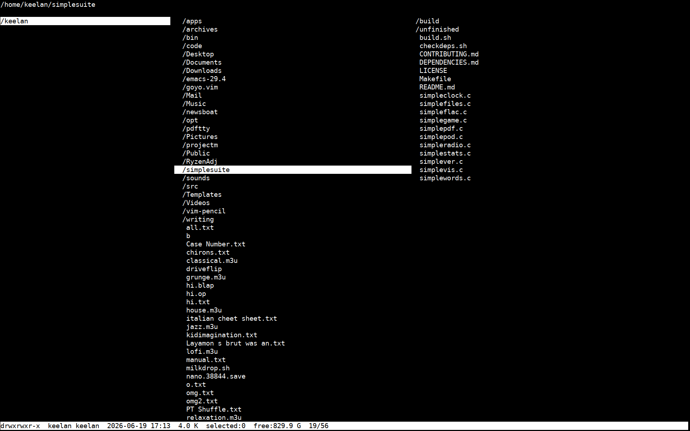
  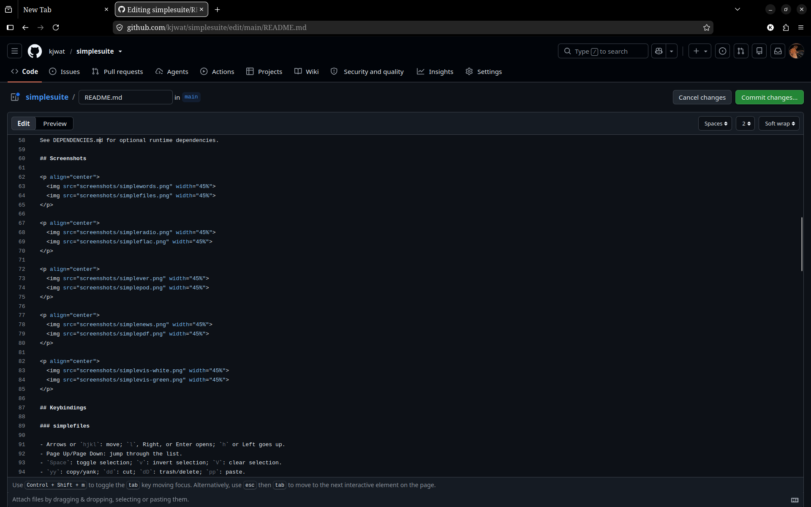
</p>

<p align="center">
  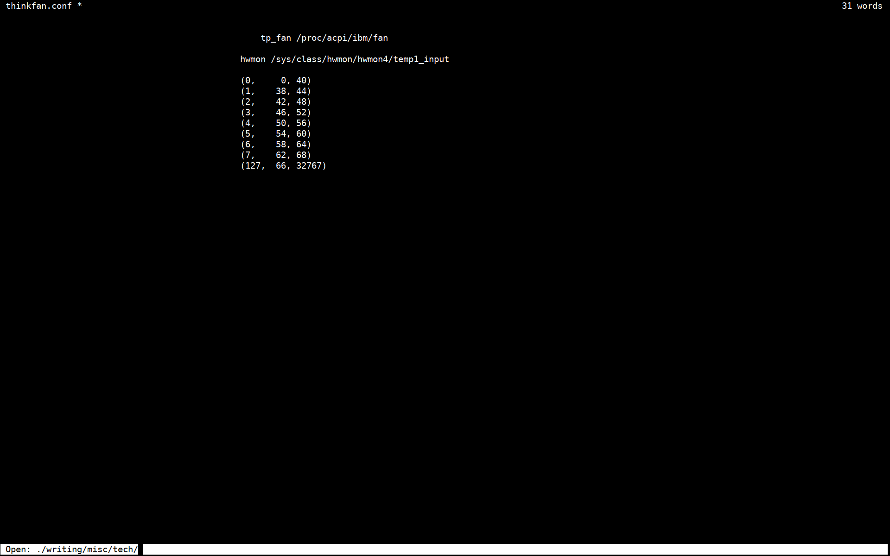
  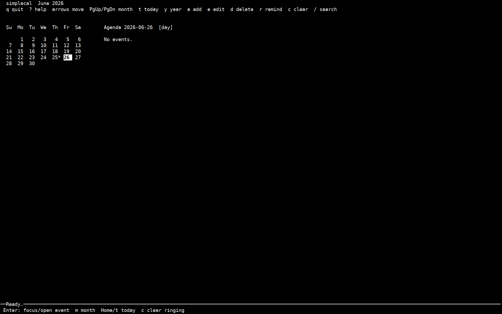
</p>

<p align="center">
  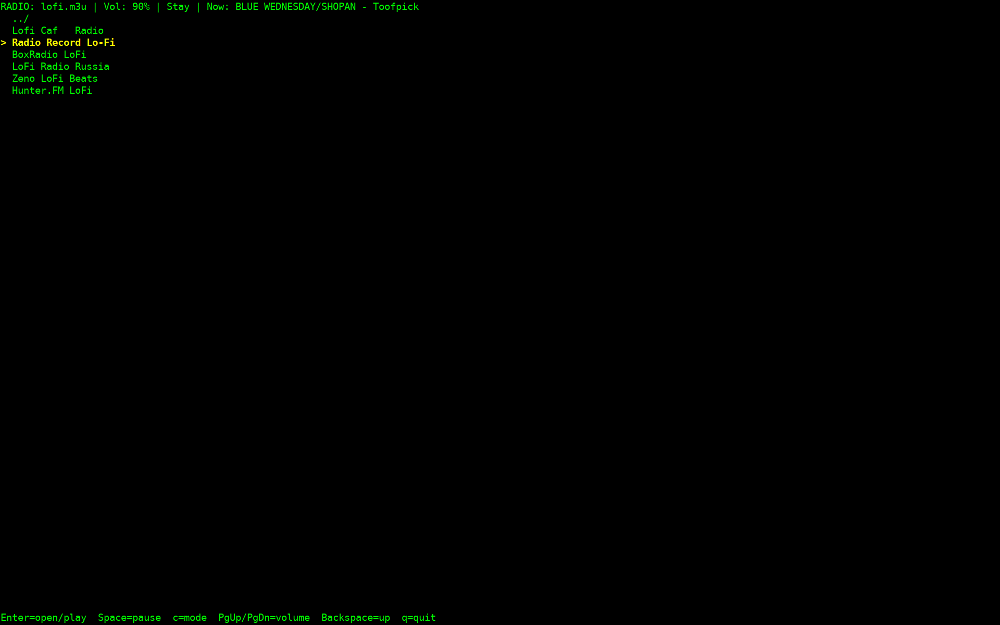
  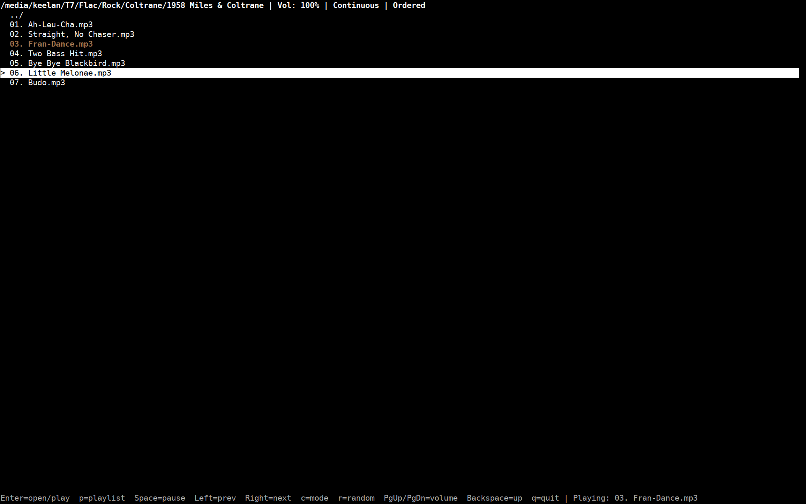
</p>

<p align="center">
  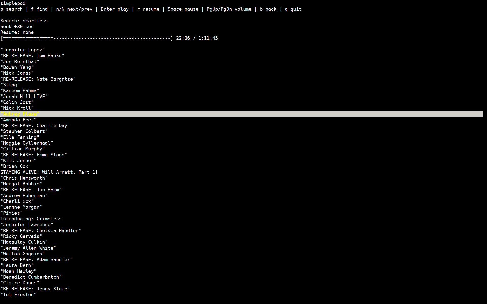
  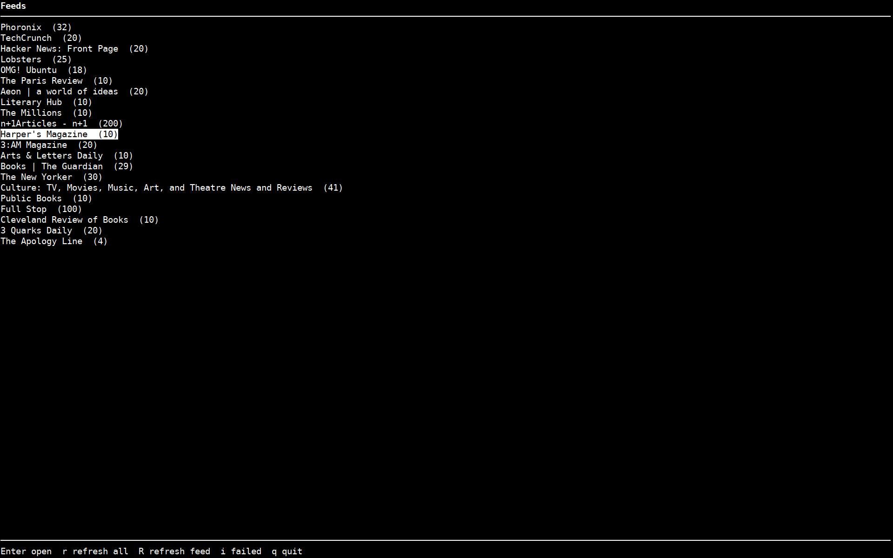
</p>

<p align="center">
  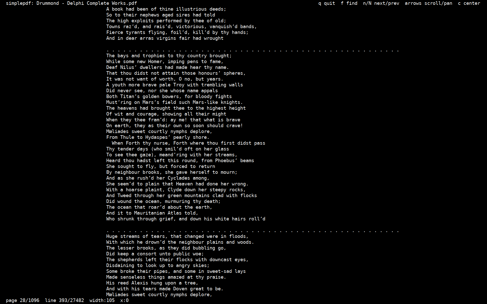
  
</p>

<p align="center">
  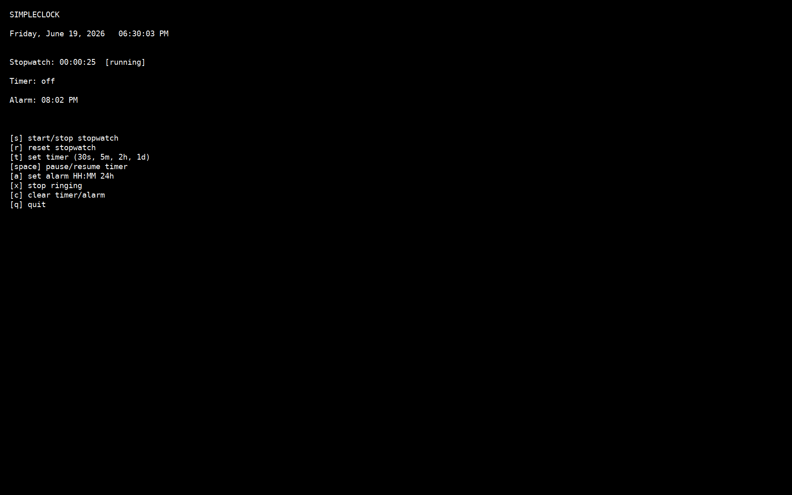
  
</p>

<p align="center">
  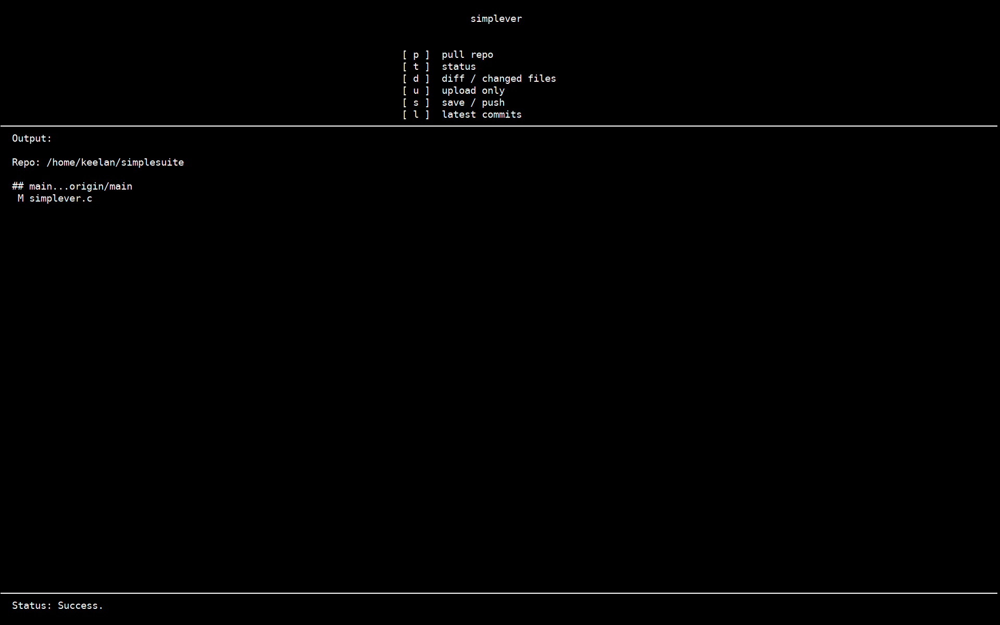
  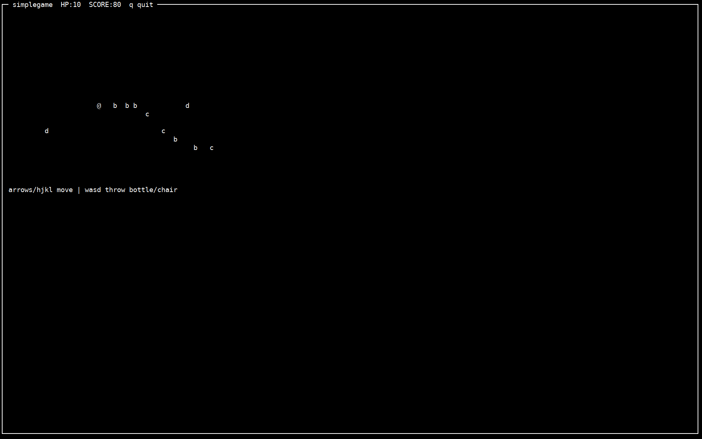
</p>

<p align="center">
  
</p>

## Keybindings

### simplefiles

- Arrows or `hjkl`: move; `l`, Right, or Enter opens; `h` or Left goes up.
- Page Up/Page Down: jump through the list.
- `Space`: toggle selection; `v`: invert selection; `V`: clear selection.
- `yy`: copy/yank; `dd`: cut; `dD`: trash/delete; `pp`: paste.
- Paste operations run in the background; the status bar reports completion.
- `cw`: rename current entry; `a`: make directory.
- `/`: search; `n`/`N`: next/previous match; `.`: toggle hidden files.
- `:`: command mode; `o`: open with application; `t`: shell here; `q`: quit.

### simplemail

- Arrows or `hjkl`: move; `Enter` opens message/thread; `Backspace` returns.
- `Page Up/Page Down`: jump through the message list.
- `m`: open mailbox chooser; `m` again closes it.
- Mailboxes: Inbox, Sent, Drafts, Archive, Trash.
- `c`: compose new message.
- `r`: reply to current message.
- `p`: pull/sync Inbox; `P`: pull/sync all mailboxes.
- `Space`: toggle selection and advance to next message.
- `v`: invert selection; `V`: clear selection.
- `a`: archive current message or selection.
- `dD`: delete/trash current message or selection; confirmation appears in footer.
- `u`: restore message from Trash.
- Related messages are grouped into conversations; Enter opens the conversation.
- Opening a message marks it read.
- `o`: open attachments.
- `/`: search; `n`/`N`: next/previous match.
- `q`: quit.

### simplewords

- Arrows and Page Up/Page Down navigate; Shift plus navigation extends selection.
- `Ctrl-X Ctrl-F`: open; `Ctrl-X b`: blank document; `Ctrl-X Ctrl-S`: save.
- `Ctrl-X Ctrl-W`: save as; `Ctrl-X Ctrl-C`: quit.
- `Ctrl-S`: find text; `n`/`N`: next/previous match.
- `Ctrl-X u`: undo; `Ctrl-X r`: redo; `Ctrl-X Ctrl-Z`: focus mode.
- `Alt-W`: copy selection; `Ctrl-W`: cut; `Ctrl-Y`: paste.

### simplecal

- Left/Right: previous/next day.
- Up/Down: previous/next week; in event focus or search, move through events.
- Page Up/Page Down: previous/next month.
- `Home` or `t`: today.
- `y`: year view; `m`: month view.
- `a`: add event; `e`: edit selected event; `d`: delete selected event.
- `r`: set or clear reminder for selected event.
- `c`: clear ringing reminders.
- `/`: search events.
- `Enter`: focus/open the selected day or event.
- `?`: help; `q`: quit.

### simpleflac

- `simpleflac PATH` opens a track, cue sheet, playlist, or directory directly; tracks begin playing automatically.
- Up/Down or `j`/`k`: select; Enter: open/play; Backspace: go up.
- `Space`: pause; `c`: mode/clear playlist; `p`: add to playlist.
- Left/Right: previous/next; `r`: random on/off.
- Page Up/Page Down: volume up/down; `q`: quit.

### simpleradio

- Up/Down or `j`/`k`: select; Enter: open/play; Backspace: go up.
- `Space`: pause; `c`: toggle auto-next/stay mode.
- Page Up/Page Down: volume up/down; `q` or Esc: quit.

### simplepod

- Up/Down: select; Enter: open/play.
- `s`: podcast search; `f`: find in list; `n`/`N`: next/previous match.
- Left/Right: seek -15/+30 seconds.
- Page Up/Page Down: volume up/down.
- `r`: resume selected episode when available; `Space`: pause.
- `b` or Backspace: go back; `q`: quit.

### simplenews

- Up/Down or `j`/`k`: move; Enter opens; Backspace goes back.
- `o`: open the article in the configured browser.
- `r`: refresh all feeds.
- `R`: refresh the current feed.
- `i`: show or hide failed feeds.
- `g`/`G`: top/bottom.
- `q`: quit.

### simplepdf

- Up/Down or `j`/`k`: scroll vertically.
- Left/Right or `h`/`l`: horizontal scroll.
- Page Up/Page Down: page through text.
- `f`: find; `n`/`N`: next/previous match.
- `c`: recenter; `g`: top; `G`: bottom; `q` or Esc: quit.

### simplevis

- `q`: quit; `i`: information overlay; `c`: color cycling.
- `+`/`-`: gain up/down.
- Left/Right: bar width; Up/Down: vertical reach.

### simpleclock

- `s`: stopwatch start/stop; `r`: reset stopwatch.
- `t`: set timer; `Space`: pause/resume timer.
- `a`: set alarm; `x`: stop ringing; `c`: clear timer/alarm; `q`: quit.

### simplecal

- Left/Right: previous/next day.
- Up/Down: previous/next week; in event focus or search, move through events.
- Page Up/Page Down: previous/next month.
- `Home` or `t`: today.
- `y`: year view; `m`: month view.
- `a`: add event; `e`: edit selected event; `d`: delete selected event.
- `r`: set or clear reminder for selected event.
- `c`: clear ringing reminders.
- `/`: search events.
- `Enter`: focus/open the selected day or event.
- `?`: help; `q`: quit.

### simplestats

- `q`: quit.

### simplever

- `p`: pull; `t`: status; `d`: diff summary.
- `u`: push/upload only; `s`: commit and push.
- `l`: latest commits; `q`: quit.

### simplegame

- Arrows or `hjkl`: move.
- `w/a/s/d`: throw.
- `q`: quit.

## SimpleNews Configuration

Feeds are stored in:

```text
~/.config/simplenews/urls
```

One feed per line:

```text
https://www.newyorker.com/feed/everything
https://lithub.com/feed/
The Paris Review | https://www.theparisreview.org/blog/feed/
```

Optional settings are stored in:

```text
~/.config/simplenews/config
```

Example:

```text
browser=links
timeout=20
max_articles=200
```

Example files are created automatically on first build.

## SimpleMail Configuration

Configuration is stored in:

```text
~/.config/simplemail/config
```

Example:

```text
# maildir=~/Mail

inbox=Inbox
sent=Sent
drafts=Drafts
archive=Archive
trash=Trash

sync_cmd=mbsync inbox
send_cmd=msmtp -t
```

## SimpleCal Storage and Reminders

Events are plain text files under:

```text
DATA_DIR/events/YYYY/YYYY-MM-DD.cal
```

Reminder state is stored in:

```text
DATA_DIR/reminders.db
```

The fixed config file is:

```text
~/.config/simplecal/config
```

It stores:

```text
DATA_DIR=/absolute/path
```

Run setup again or set the data directory directly with:

```bash
simplecal --setup
simplecal --data-dir /path/to/calendar
```

simplecal installs the background reminder checker automatically on first launch when possible. To retry setup manually:

```bash
simplecal --install-reminders
```

This installs a systemd user timer when available, otherwise a cron entry. The systemd timer checks once per second (`OnUnitActiveSec=1s`, `AccuracySec=1s`) so alarms fire close to their due time. The cron fallback runs once per minute and is less precise.

When a reminder becomes due, it changes to `STATUS=ringing` and the alarm keeps playing or replaying until it is cleared. Clear alarms in the TUI with `c`, or from the shell:

```bash
simplecal --clear-reminder EVENT_ID
simplecal --clear-all-reminders
```

Reminder playback logs the due time, current time, drift, alarm path, audio environment, player command, player PID, and exit status. It tries `mpv` with PipeWire, Pulse, and auto output, then `pw-play`, `paplay`, and `ffplay`. Set `SIMPLECAL_ALARM_PLAYER` to override this for testing or local setups. The checker can also be run manually:

```bash
simplecal --check-reminders
simplecal --reconcile-reminders
```

SimpleMail reads mail from local Maildir folders.

Maildir precedence is: an uncommented `maildir` entry in
`~/.config/simplemail/config`, then `SIMPLEMAIL_MAILDIR`, then an existing legacy
`~/.local/share/simplemail/mail` directory if `~/Mail` does not exist, then
`~/Mail`.

We recommend `mbsync` for downloading mail and `msmtp` for sending it. Proton
Mail users can use Proton Mail Bridge together with `mbsync`.

Example configuration files are created automatically on first build.

## Additional Simplefiles Commands

Press `:` to enter command mode.

```text
:mkdir <name>       Create directory
:rename <newname>   Rename selected file
:compress <name>    Create ZIP archive from selection
:extract            Extract selected ZIP archive
:delete             Move selected file(s) to trash
:emptytrash         Permanently empty trash
:openwith <prog>    Open file with chosen application
```

## GitHub Setup (SimpleVer)

GitHub pushes work best over SSH.

If your remote uses HTTPS:

```sh
git remote -v
```

and you see:

```text
https://github.com/USER/REPO.git
```

switch it once:

```sh
git remote set-url origin git@github.com:USER/REPO.git
ssh -T git@github.com
```

After that, SimpleVer can save and push normally.

## License

See [LICENSE](LICENSE).
