# SimpleSuite

SimpleSuite is a collection of lightweight terminal applications written in C
and ncurses. It is meant to provide a complete local-first workspace without a
database or desktop shell dependency.

## Applications

| Program | Purpose |
| --- | --- |
| `simplefiles` | File manager |
| `simpleserve` | LAN share discovery and real NFS mounts (FreeBSD/Linux) |
| `simplenet` | Wi-Fi manager, mesh optimizer, network auditor, and adapter care |
| `simplemail` | Local Maildir mail client |
| `simplewords` | Text editor / word processor |
| `simplecal` | Offline calendar and reminder app |
| `simpleclock` | Clock, stopwatch, timer, and alarm |
| `simpleflac` | Local audio player |
| `simpleradio` | Internet radio player |
| `simplepod` | Podcast search, episode browser, and player |
| `simplenews` | RSS and Atom reader |
| `simplebrowse` | Text-mode HTTP/HTTPS web browser |
| `simplepdf` | PDF/EPUB text reader |
| `simplevis` | Audio visualizer |
| `simplestats` | System monitor |
| `simplever` | Git frontend |
| `simplegame` | Small terminal arcade game |

## Installation

```sh
git clone https://github.com/kjwat/simplesuite.git
cd simplesuite
./checkdeps.sh
./build.sh
```

On macOS, that same `./build.sh` command detects Darwin, verifies macOS and the
selected SDK, installs any missing Homebrew dependencies, selects `gmake`, and
builds the native Apple implementation. Homebrew itself and Apple's Command
Line Tools must already be installed. Include optional convenience tools with:

```sh
./build.sh --with-extras
```

`install-macos.sh` remains as a compatibility alias for `build.sh`. Set
`SIMPLESUITE_INSTALL_PACKAGES=0` when a parent provisioner has already installed
the macOS packages.

See [MACOS.md](MACOS.md) for the native integrations, permission prompts, and
validation commands.

`build.sh` runs the independent builds concurrently (up to eight jobs by
default), then installs the programs into `~/.local/bin` and shared audio
assets into:

```text
~/.local/share/simplesuite/simplecal-alarm.mp3
~/.local/share/simplesuite/simplewords-typewriter.wav
~/.local/share/simplesuite/simplewords-typewriter-alt.wav
~/.local/share/simplesuite/simplewords-typewriter-space.wav
~/.local/share/simplesuite/simplewords-typewriter-enter.wav
~/.local/share/simplesuite/simplewords-typewriter-delete.wav
```

It also installs `simplesuite-uninstall` and creates SimpleNews example files
plus SimpleFiles, SimpleMail, and SimpleWords config files if they do not
already exist. Existing user config files are left intact. SimpleWords sound
remains off by default; volume `70` is the recommended level when it is
enabled.

On FreeBSD and Linux, an interactive `build.sh` also installs, enables, starts,
and verifies the privileged SimpleServe service through `sudo`. Set
`SIMPLESUITE_INSTALL_SIMPLESERVE_SYSTEM=require` when an unattended parent
installer must fail unless that service is ready, or `skip` when deliberately
managing it separately. Set `SIMPLESUITE_INSTALL_SIMPLESERVE=0` to omit both
SimpleServe binaries entirely; the default is `1`. On a reinstall, opting out
also removes an existing SimpleServe system service and its managed Linux fstab
block while preserving `/etc/simpleserve.conf` for a later opt-in. Staged
`DESTDIR` builds never modify the host service.

Set `SIMPLESUITE_JOBS` to control the concurrency, including `1` for a serial
build:

```sh
SIMPLESUITE_JOBS=4 ./build.sh
```

The normal build prints one short `CC` line per program. To run the stricter
warning audit used by the project:

```sh
make check-warnings
```

On FreeBSD, install `gmake` and the dependencies listed in `DEPENDENCIES.md`.
On macOS, `build.sh` installs missing Homebrew formulae automatically; on both
systems it selects `gmake`. SimpleFiles uses
native platform storage APIs on macOS and the native mount table for validated
unmounts on FreeBSD. SimpleStats and SimpleNet likewise use native Apple
frameworks on macOS and native FreeBSD interfaces on FreeBSD.

If commands such as `simplewords` are not found after installation, add
`~/.local/bin` to your PATH:

```sh
echo 'export PATH="$HOME/.local/bin:$PATH"' >> ~/.bashrc
source ~/.bashrc
```

For zsh:

```sh
echo 'export PATH="$HOME/.local/bin:$PATH"' >> ~/.zshrc
source ~/.zshrc
```

## Uninstallation

From the source checkout, remove the complete installed suite with:

```sh
./uninstall.sh
```

The installer also puts `simplesuite-uninstall` on `PATH`, so uninstallation
still works after the source checkout has been removed:

```sh
simplesuite-uninstall
```

The normal uninstall removes every SimpleSuite executable, runtime helper,
shared audio asset, SimpleCal/SimpleClock background reminder hook, and the
matching SimpleServe system service. It withdraws SimpleServe's managed NFS
exports while preserving its share configuration and remembered mounts for a
future reinstall. It also preserves user configuration, caches, state,
calendars, Maildirs, SimpleFiles trash, downloads, and the source checkout.
Preview the operation or also remove application and SimpleServe system
settings, caches, and transient state with:

```sh
./uninstall.sh --dry-run
./uninstall.sh --purge
```

Even `--purge` deliberately preserves personal content: calendar data,
Maildirs, SimpleFiles trash, downloads, and source files.

For complete removal, including configuration, caches, recovery state,
calendar data, SimpleMail Maildirs, SimpleFiles trash, installed assets, and
the recorded SimpleSuite source checkout, use the deliberately destructive
burn mode:

```sh
./uninstall.sh --burn
```

It requires typing `BURN` exactly. For a noninteractive disposable/test
installation, `--burn --yes` supplies that confirmation. `--dry-run --burn`
previews the same scope without deleting anything. Burn removes everything it
can identify as SimpleSuite-owned; it does not remove shared system packages
or unrelated documents in general-purpose directories such as `~/Downloads`.

See [DEPENDENCIES.md](DEPENDENCIES.md) for required build packages and optional
runtime features.

## SimpleServe

SimpleServe discovers Unix shares with mDNS and mounts them through the
kernel's NFS client. It does not create a private file-browser abstraction: a
successful mount is a normal VFS directory usable by `ls`, SimpleWords,
SimpleFlac, `mpv`, and every other local program.

On FreeBSD and Linux, the ordinary interactive build installs the `simpleserve`
client and automatically installs `simpleserved` as a root system service. If
the automatic step was intentionally skipped, the equivalent manual command
is:

```sh
# FreeBSD
sudo gmake install-simpleserve-system

# Linux (GNU make)
sudo make install-simpleserve-system
```

The installer supports FreeBSD rc.d plus Linux systemd and OpenRC. It installs
`/usr/local/sbin/simpleserved` and a matching privileged uninstaller, enables
the service, starts it, and verifies the installed bytes, NFS and Avahi runtime
commands, live service state, and control socket. NFS and Avahi are enabled
only when SimpleServe first needs them.

Register the root of a currently mounted local filesystem on the server:

```sh
simpleserve share /media/T7
simpleserve share /media/Music --read-only
```

SimpleServe records the filesystem UUID, not just the transient directory
name. It refuses ordinary leftover directories, autofs placeholders, NFS
re-exports, read-only filesystems requested as writable, and paths the caller
cannot access. If the drive disappears or the mount identity changes, the NFS
export and mDNS availability are withdrawn; the empty mountpoint is never
exported in its place.

On Linux, registering a UUID-backed filesystem also adds it to a clearly
marked SimpleServe block in `/etc/fstab`. The generated entry uses `nofail`, so
an unplugged drive cannot hold up boot, and the daemon keeps the entry while
the drive is temporarily absent. `simpleserve unshare NAME`, the normal system
uninstaller, and purge all remove the corresponding managed entry or block
without changing unrelated fstab mounts. Starting or reinstalling the service
reconciles the block from `/etc/simpleserve.conf`.

On a client:

```sh
simpleserve discover
simpleserve mount thetyper:T7
simpleserve mount thetyper:Music --remember
```

Mounts use this fixed layout:

```text
~/SimpleServe/
└── thetyper/
    ├── T7/
    └── Music/
```

`--remember` reconnects the mount after daemon or network restarts. When a
server vanishes, the daemon marks the mount unavailable and attempts a normal,
non-forced unmount after repeated misses; busy mounts are left intact rather
than tearing files away from running applications.

FreeBSD NFSv3 clients use `READDIRPLUS` and four-block read-ahead so large
directory listings avoid per-entry metadata round trips and sequential reads
can keep multiple requests in flight.

The useful acceptance test is deliberately outside SimpleServe itself:

```sh
mount | grep SimpleServe
df -h ~/SimpleServe/thetyper/T7
ls ~/SimpleServe/thetyper/T7
cp poem.txt ~/SimpleServe/thetyper/T7/
mpv ~/SimpleServe/thetyper/T7/movie.mkv
```

Discovery advertises `_simpleserve._tcp.local` and retrieves a versioned share
manifest on TCP port 7337; NFSv3 over TCP carries file data. Exports are
limited to active private IPv4 LANs and all remote credentials are mapped to
the local user who registered the share, so matching numeric UIDs across
FreeBSD and Linux are not required. This first version is for trusted LANs:
NFSv3 AUTH_SYS is not encrypted and is not suitable for an untrusted Wi-Fi or
the public internet.

Server configuration lives at `/etc/simpleserve.conf`. Remembered client
mounts live at `/var/db/simpleserve/mounts.conf` on FreeBSD and
`/var/lib/simpleserve/mounts.conf` on Linux. SimpleFiles has not been changed;
it can later treat `~/SimpleServe` like any other directory because these are
already real mounts.

## Notes

- The default build installs all programs listed above.
- `simpleclock`, `simplepod`, `simplenews`, and `simplebrowse` require libcurl at build time.
- `simplebrowse` v4 defaults to a fast automatic path: it fetches ordinary
  pages directly with reusable HTTP connections and starts
  `simplebrowse-webkitd` only for known browser-only sites or detected
  JavaScript shells. The helper uses native WKWebView on macOS and WebKitGTK
  elsewhere. You can still force either backend.
- SimpleBrowse preserves search forms when possible. For DuckDuckGo,
  Wikimedia sister sites, and Project Gutenberg, it recreates search forms
  when reader extraction would otherwise omit them.
- Pressing Enter on a direct audio, video, image, PDF, or EPUB link downloads
  it to the browser cache and opens it with the system MIME application.
- Shift-Enter on a direct file link opens an editable Save As path in the
  footer, defaulting to the original filename under `~/Downloads`.
- Audio programs require `mpv` for normal playback.
- `simplecal` and `simpleclock` use the installed alarm MP3 and try `mpv`
  first, with fallback players where supported.
- On FreeBSD, `simplefiles` uses the privileged
  `simplefiles-freebsd-unmount` helper for root-owned `/media` mounts and
  unmounts.
  `./build.sh` installs it with sudo during interactive installs. Set
  `SIMPLESUITE_INSTALL_FREEBSD_HELPER=skip` to skip that step, or `require`
  to fail the install if the privileged helper cannot be installed. The helper
  is executable only by `operator`, requires the caller to have raw-device read
  access, accepts an exact validated media path/device pair, and mounts through
  the native media map with `rw`, `nosuid`, `noatime`, and `automounted`.
  The normal autofs mount is attempted first, so healthy media avoids a full
  filesystem scan. If that attempt fails, the helper checks the unmounted
  filesystem with a fixed, root-owned native checker; dirty filesystems receive
  one noninteractive repair, verification, and mount retry. It has no read-only
  retry, rejects any mount that is still read-only, and leaves media unmounted
  when recovery tooling is missing or repair fails.
  It verifies that the kernel retained the persistent safety flags (updating
  FUSE mounts when necessary), verifies its root-owned executables, gives every
  privileged child a fixed safe environment, and bounds external-command waits.
  The normal uninstaller removes the global helper too, requesting sudo when
  needed; it reports an incomplete uninstall instead of silently leaving the
  helper behind.
- On Linux, `simplefiles` starts with the normal GIO mount. Only a failed mount
  starts UDisks2 `Check`; a dirty filesystem runs `Repair`, another `Check`,
  and one mount retry. Unsupported filesystems, unavailable repair tools,
  failed repairs, device changes, and drives mounted during recovery remain
  blocked instead of falling back to read-only. On every GIO platform,
  SimpleFiles verifies the completed mount and rolls it back if it is read-only
  or its writable state cannot be established.
- On macOS, `simplefiles` discovers removable volumes through Disk Arbitration
  and IOKit, presents them under `/Volumes`, mounts and unmounts with
  `diskutil`, opens files with `open`, and sends deletions through Finder's
  native Trash API.
- SimpleWords plays its optional typewriter-key sound in-process; it does not
  need an external player, and the feature is disabled by default.
- `simplepdf` uses Poppler's `pdftotext` for cached PDF text. Large PDFs are
  extracted in bounded parallel page ranges on multicore systems, then merged
  in source order before caching. It runs `pdftohtml` as a bounded background
  job only when PDF link navigation is needed. EPUBs are streamed from their
  ordered XHTML spine with `unzip`, retaining internal anchors and destinations
  in the private text cache; `pandoc` remains a compatibility fallback.
- `simplefiles` configuration options are documented in
  `simplefiles-config.example`.
- `simplenet` automatically uses NetworkManager, iwd, or a standalone
  wpa_supplicant control interface to scan and join Wi-Fi networks. It uses
  NetworkManager's BSSID list there, FreeBSD's `ifconfig` scan table on
  FreeBSD, and the kernel `iw` scan cache with other non-NetworkManager
  backends for BSSID-level mesh discovery. It can pin the strongest visible
  same-SSID access point, audits local and internet performance, and controls
  Wi-Fi power saving. A network explicitly connected from SimpleNet becomes
  the preferred automatic connection after a restart while previously saved
  networks remain available as fallbacks. This uses NetworkManager's persistent
  autoconnect priority, iwd's automatic-connect and last-connected ranking,
  wpa_supplicant's saved network priority, and macOS's ordered CoreWLAN preferred
  network list. For standalone wpa_supplicant, SimpleNet enables
  `update_config=1` through the daemon's protected control interface and
  verifies that the configuration can be written before switching; it refuses
  a live-only switch if the daemon or configuration file prevents saving.
  NetworkManager and
  wpa_supplicant support persistent BSSID pins; iwd node selection is a
  temporary roam and iwd remains free to roam later. Its Adapter care
  view detects the active kernel driver and only offers a driver remedy when a
  matching reversible profile is known. Driver remedies require explicit
  confirmation, administrator access, and a reboot.
- On FreeBSD, `C` opens the Card screen. It lists every physical Wi-Fi device,
  the corresponding `wlan` interface, chipset, driver, link state, and the
  interface carrying the system default route. Enter changes the interface
  SimpleNet scans and connects through; it does not silently alter routes or
  disconnect another card.
- On macOS, `simplenet` scans and associates through CoreWLAN, selects exact
  mesh BSSIDs, and reads or stores personal-network credentials in Keychain.
  Enterprise enrollment and Wi-Fi power policy remain owned by macOS.
- On macOS 14.2 and newer, `simplevis` captures outgoing system audio through
  a native Core Audio process tap. It does not require PulseAudio. macOS asks
  for System Audio Recording permission on first use.
- On macOS, SimpleCal and SimpleClock install per-user launchd agents for
  persistent reminder checks; the normal SimpleSuite uninstaller unloads and
  removes both agents.
- `simplemail` reads local Maildir folders and uses configured external
  commands, normally `mbsync` for mail sync and `msmtp` for sending.
- `simplenews` defaults to `links %u` as its external browser command.
- Most tools store data under `~/.config`, `~/.local/share`,
  `~/.local/state`, or `~/.cache`.

<p align="center">
  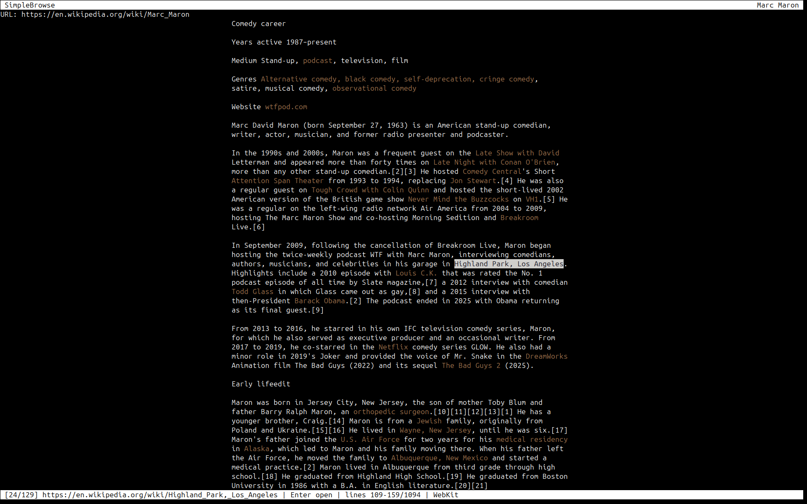
  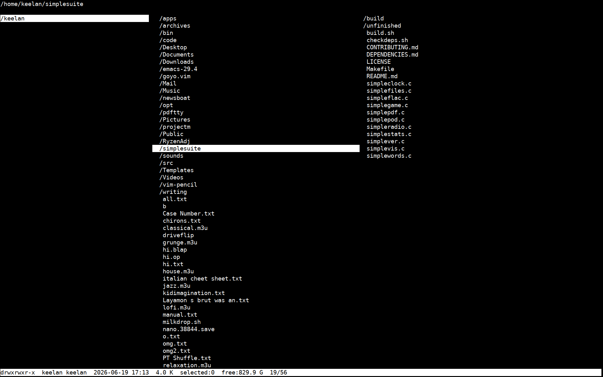
</p>

<p align="center">
  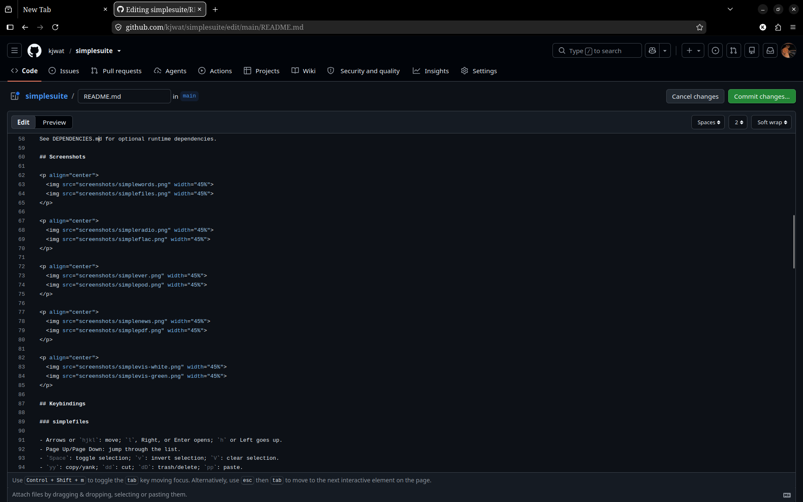
  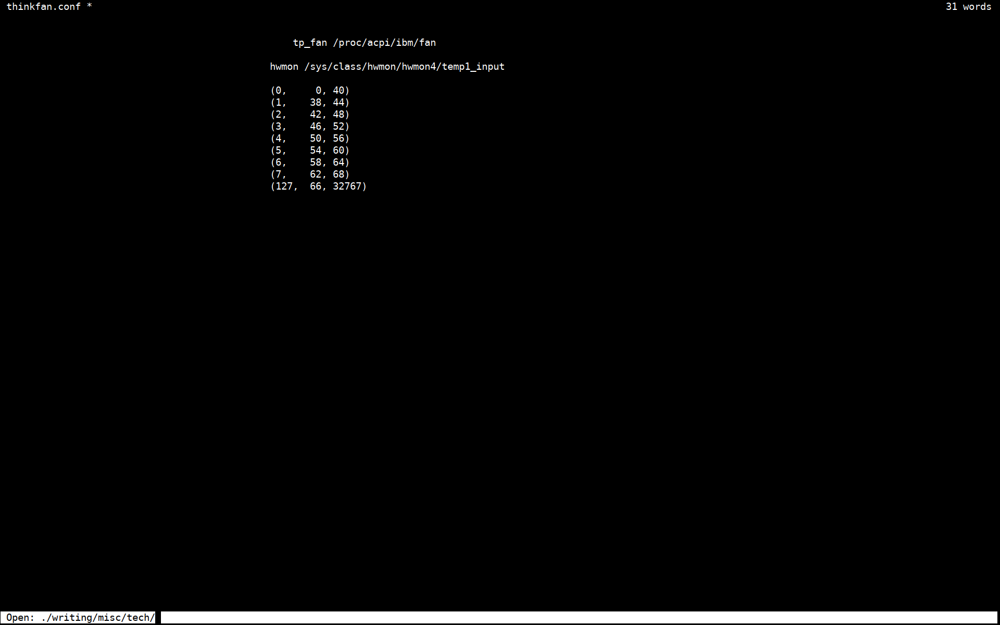
</p>

<p align="center">
  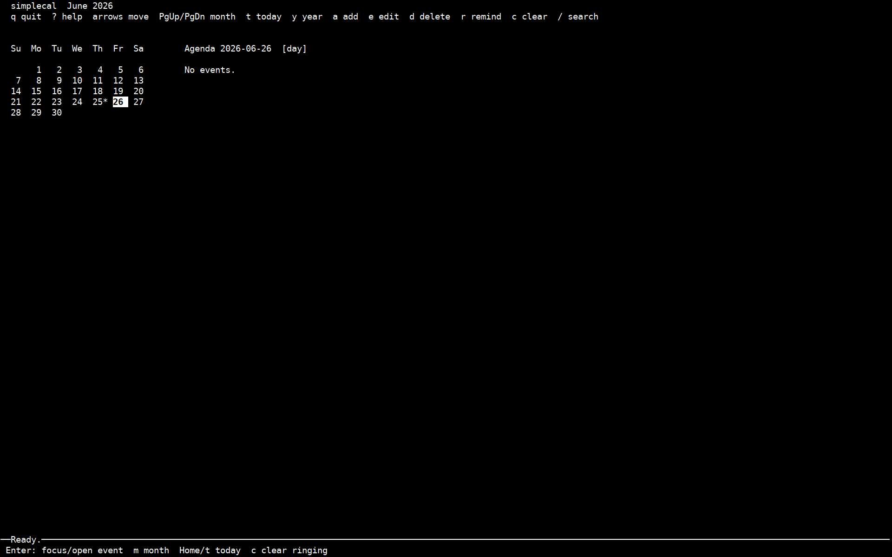
  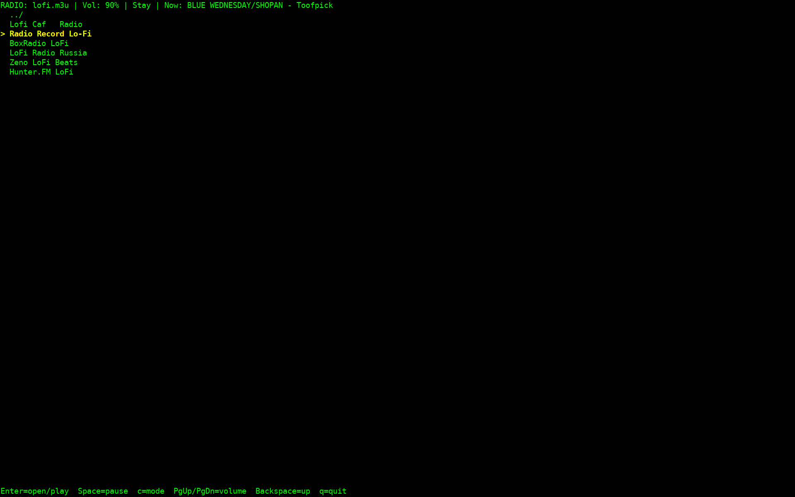
</p>

<p align="center">
  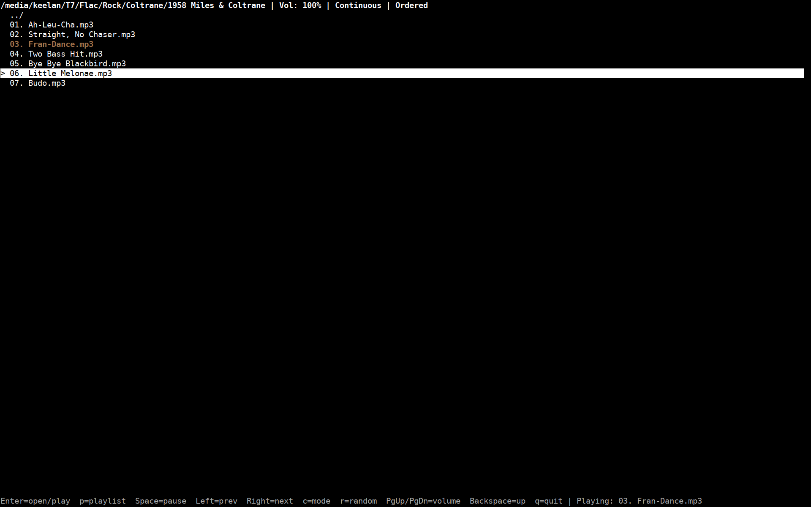
  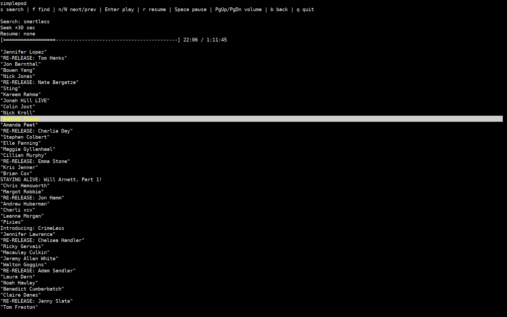
</p>

<p align="center">
  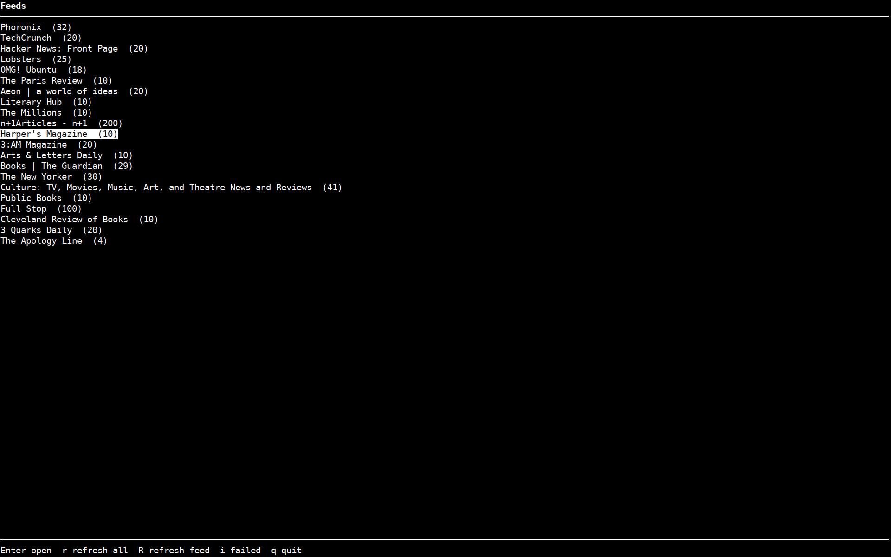
  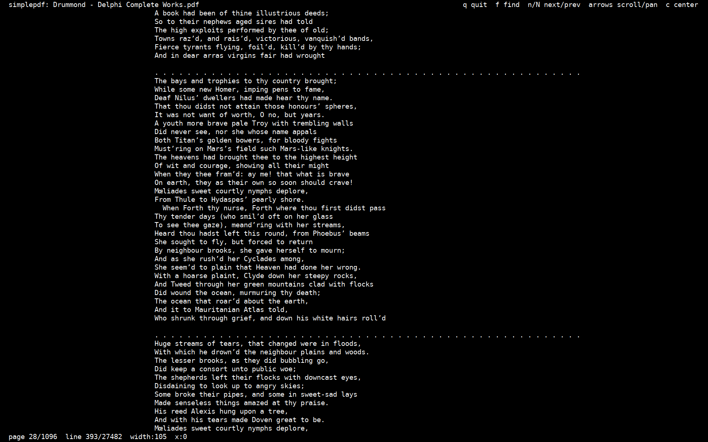
</p>

<p align="center">
  
  
</p>

<p align="center">
  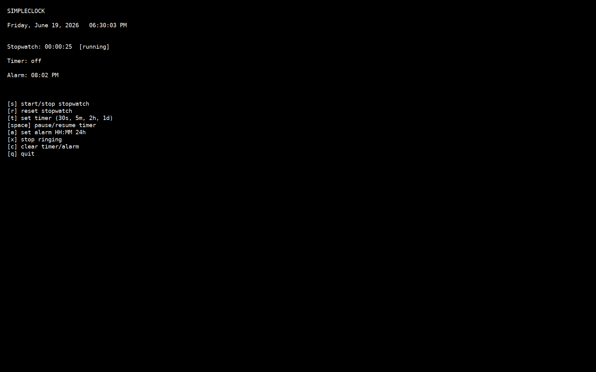
  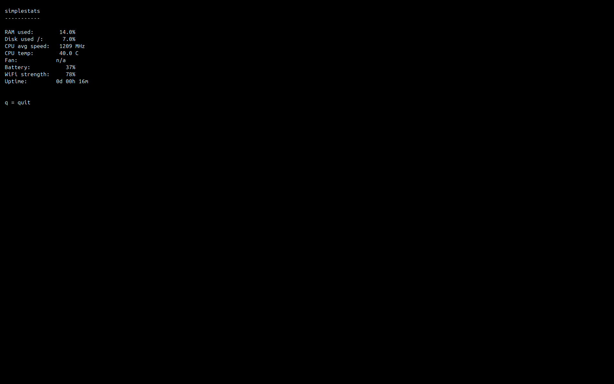
</p>

<p align="center">
  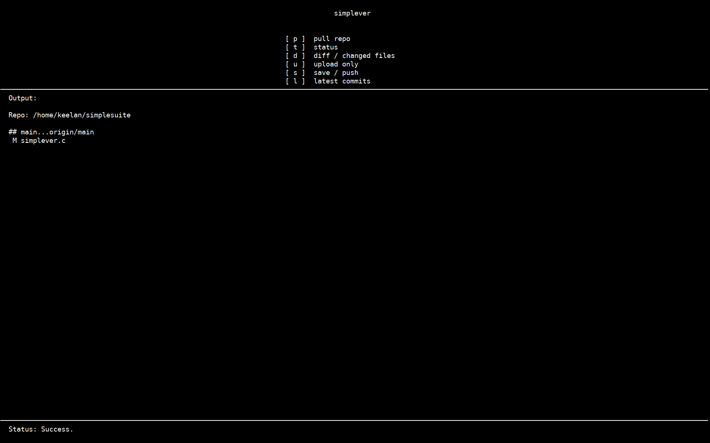
  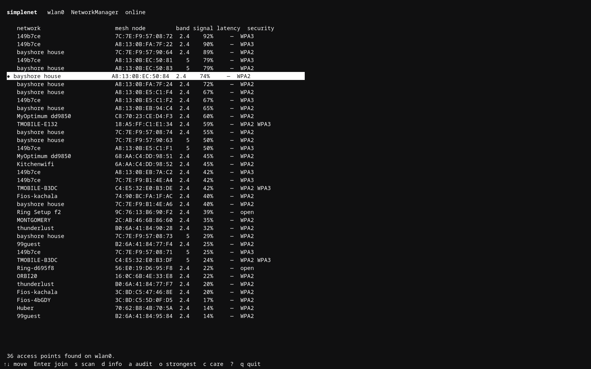
</p>

## Keybindings

### simplefiles

- Arrows or `hjkl`: move; `l`, Right, or Enter opens; `h` or Left goes up.
- Page Up/Page Down: jump through the list.
- `Space`: toggle selection and advance.
- `v`: select all / clear all toggle; `V`: invert selection.
- `yy`: copy/yank; `dd`: cut; `dD`: trash/delete; `pp`: paste.
- Paste, trash/delete, compression, extraction, empty-trash, and unmount
  operations run in the background; the status bar reports progress or
  completion.
- `cw`: rename current entry; `a`: make directory.
- `/`: search; `n`/`N`: next/previous match; `.`: toggle hidden files.
- `i`: toggle the right pane between preview and item information. Directory
  file, subdirectory, and byte totals are calculated in the background.
- `:`: command mode; `o`: open with application; `t`: shell here; `q`: quit.

### simplenet

- Arrows or `j`/`k`: choose an access point; Enter connects to it.
- Saved NetworkManager credentials are tried first. New secured networks use a
  masked password prompt; Esc cancels.
- On FreeBSD, saved wpa_supplicant networks force reassociation with the
  selected BSSID. Same-SSID mesh-node switching does not require root.
- `s`: rescan; `d`: selected access-point details.
- `a`: audit gateway latency, internet latency, and download throughput.
- `o`: select and pin the strongest visible same-SSID mesh node.
- `u`: remove the current mesh-node pin. With iwd, node selection is already
  temporary and roaming remains automatic.
- On FreeBSD, `C`: open Card; arrows choose a Wi-Fi card and Enter switches the
  interface SimpleNet manages. The system-default interface is marked
  separately.
- `c`: open Adapter care; `p`: disable Wi-Fi power saving.
- `?`: help; `q`: quit.

### simplemail

- Arrows: move; Page Up/Page Down: jump through the message list.
- Enter opens a thread or message; Backspace returns from read/thread views.
- `m`: open mailbox chooser; `m` or Esc closes it.
- Mailboxes are Inbox, Sent, Drafts, Archive, and Trash by default.
- `c`: compose new message; sending continues in the background after review.
- `r`: reply to the current message.
- `p` or `P`: run the configured sync command in the background.
- `Space`: toggle selection and advance.
- `v`: select all messages; `V`: invert selection; Esc clears selection.
- `a`: archive the current message or selection.
- `dD`: start delete/trash confirmation; `y` confirms.
- `u`: restore from Trash or Archive.
- `o`: open attachment; `s`: save attachment.
- `/`: search; `n`/`N`: next/previous match.
- `q`: confirm and quit.

### simplewords

- Startup behavior:
  - `words filename` opens or resumes that document, recovering a newer
    autosave if present.
  - `words` resumes the previous writing session, named or untitled.
  - `Ctrl-X b` starts a new blank document and makes that the next session.
- Arrows and Page Up/Page Down navigate.
- Shift plus arrows/Page Up/Page Down extends selection where the terminal
  reports modified keys.
- `Ctrl-X Ctrl-F`: open; `Ctrl-X b`: new blank document.
- `Ctrl-X Ctrl-S`: save; `Ctrl-X Ctrl-W`: save as.
- `Ctrl-X Ctrl-C`: quit.
- `Ctrl-S`: find text; `n`/`N`: next/previous match.
- `Ctrl-X u`: undo; `Ctrl-X r` or `Ctrl-R`: redo.
- `Ctrl-X Ctrl-Z`: focus mode.
- `Ctrl-X Ctrl-T`: toggle typewriter sounds and save the setting to the config.
- `Alt-W`: copy selection; `Ctrl-W`: cut; `Ctrl-Y`: paste.

### simplecal

Top-level month view:

- Month grid and agenda are sibling focus areas.
- Tab or Shift-Tab switches focus between the month grid and agenda.
- In month-grid focus, arrows move by day or week.
- In agenda focus, Up/Down moves through events and Left/Right changes day.
- Page Up/Page Down: previous/next month.
- `Home` or `t`: today.
- `y`: year view; `m`: month view.
- Enter from the month grid focuses the agenda.
- Enter from the agenda opens the selected event detail.
- Backspace at top level only moves agenda focus back to the month grid.
- `a`: create an event for the selected day.
- `e`: edit the selected agenda or search event.
- `d`: delete the selected agenda or search event; `D` confirms the first
  delete prompt.
- `/`: search events.
- `c`: clear ringing reminders.
- `?`: help.
- `q`: quit from the top-level month/year view.

Event card:

- Event detail is read-only until edited.
- In read-only detail, `e` edits; Esc or Backspace returns to the agenda.
- In create/edit mode, Tab, Shift-Tab, Up, and Down move between fields.
- Enter moves to the next field; on the Reminder row it opens the reminder
  card.
- Backspace edits text only; it does not save, cancel, or leave the card.
- Esc cancels edits and returns one level up.
- `Ctrl-S` saves and returns to the agenda.

Reminder card:

- Up/Down or Tab/Shift-Tab moves through alert and repeat choices.
- Enter or Space selects the highlighted choice.
- `Ctrl-S` applies the reminder choices back to the event edit card.
- Esc or Backspace cancels reminder-card changes.

Recurring delete:

- Deleting a recurring event prompts for `this occurrence`, `whole series`, or
  `cancel`.
- Esc or Backspace cancels that prompt.

### simpleflac

- `simpleflac PATH` opens a track, cue sheet, playlist, or directory directly.
- Up/Down or `j`/`k`: select; Enter: open/play; Backspace: go up.
- `Space`: pause.
- `c`: playlist/mode action shown in the footer.
- `p`: add to playlist/queue.
- Left/Right: previous/next track.
- Shift-Left/Shift-Right: seek back/forward 15 seconds.
- The top progress bar shows elapsed and total track time.
- `r`: random on/off.
- Page Up/Page Down: volume up/down.
- `q`: quit.

### simpleradio

- `simpleradio PATH` opens a playlist or directory directly.
- Up/Down or `j`/`k`: select; Enter: open/play; Backspace: go up.
- `Space`: pause.
- `c`: toggle auto-next/stay mode.
- Page Up/Page Down: volume up/down.
- Station startup runs in the background, leaving navigation responsive while
  the status line reports connection or retry results.
- `q` or Esc: quit.

### simplepod

- Up/Down: select; Enter: open a show or play an episode.
- `i`: podcast search.
- `D`: deep episode search after an initial podcast search.
- `f`: find in the visible list; `n`/`N`: next/previous match.
- Left/Right: seek -15/+30 seconds.
- Page Up/Page Down: volume up/down.
- `r`: resume selected episode when resume data is available.
- `Space`: pause.
- `b` or Backspace: go back.
- `q`: quit.

### simplenews

- Up/Down or `j`/`k`: move.
- Enter opens a feed, article list item, or article.
- Backspace, Left, or `h`: go back.
- `p`: pull/refresh all feeds in the background.
- `R`: refresh the current feed in the background.
- Esc cancels an active feed refresh.
- `o`: open the selected article in the configured browser.
- `i`: show or hide failed feeds.
- `g`/`G`: top/bottom.
- `q`: quit.

### simplebrowse

- `simplebrowse URL`: use fast auto mode, preferring the direct static path and
  falling back to WebKitGTK only when needed.
- `simplebrowse --reader URL`: force the direct static reader path.
- `simplebrowse --js URL`: force WebKitGTK JavaScript mode.
- `simplebrowse --dump URL`: print cleaned page text; automatically retries
  likely JavaScript shells with JS mode when available.
- `simplebrowse --dump-js URL`: print cleaned page text after JavaScript.
- `simplebrowse --dump-links URL`: print the computed visible link navigation
  list with rendered line/column bounds.
- `simplebrowse --dump-links-js URL`: print the link list after JavaScript.
- `simplebrowse --clear-cache`: remove cached page snapshots from
  `$XDG_CACHE_HOME/simplebrowse/pages` or `~/.cache/simplebrowse/pages`.
- Ctrl-L: focus the URL bar.
- Enter: load the URL bar, open the selected link, edit the selected field, or
  submit the selected form button.
- Digits then Enter: open or activate the numbered visible link/field group.
- Shift-Down/Shift-Up: next/previous visible link or form control, jumping
  screens as needed. Links are underlined before selection.
- Page Down/Page Up: scroll one screen.
- Space: toggle a selected checkbox/radio button; otherwise page down.
- Up/Down or `j`/`k`: scroll line by line.
- `b` or Space: page through text.
- Backspace: back.
- Home/End: top/bottom.
- `g`: likely article/content heading; `G`: past top navigation.
- `/`: find; `n`/`N`: next/previous match.
- `f`: forward.
- `r`: reload in the selected mode.
- `A`: select fast auto mode and reload.
- `B` (or legacy `J`): select WebKit mode and reload.
- `R`: select static reader mode and reload.
- `m`: bookmark current page; `M`: bookmark list.
- `s`: save cleaned page text.
- `C`: clear cached page snapshots.
- `o`: open current URL externally; `O`: open selected link externally.
- `q`: quit.

Form fields use the same terminal editing conventions as SimpleWords where the
browser can reasonably share them: Enter starts editing or submits, Esc leaves
field editing, Tab inserts a tab while editing, Ctrl-Left/Right moves by word,
Shift-Left/Right selects, Alt-w copies, Ctrl-w cuts, Ctrl-y pastes, Ctrl-z
undoes, and Ctrl-r redoes.

### simplepdf

- PDFs open in a centered, reflowed reading layout; use `--layout` to start in
  the source layout instead. Extracted text is cached privately so repeat opens
  do not rerun the converter.
- Up/Down or `j`/`k`: scroll vertically.
- Page Up/Page Down or Space/`b`: move by one screen.
- Shift-Up/Shift-Down: select the previous/next internal link; the first press
  starts with the visible screen, and Enter follows it. PDF contents links are
  scanned in the background from the first paint and underlined when ready;
  unusual PDF links in prose are inspected on demand. EPUB anchors are retained
  during extraction.
- Backspace: return to the exact reading position before a link or chapter
  jump. Repeated jumps maintain a back stack.
- `o`: open the chapter navigator. It is available for PDFs and EPUBs; EPUB
  contents destinations come from the book's navigation map when available.
- `[`/`]`: previous/next physical PDF page; `p`: go to a page number.
- `/` or `f`: find; `n`/`N`: next/previous match.
- `r`: toggle reading/source layout. In source layout, Left/Right or `h`/`l`
  pans horizontally and `c` or `0` returns to the left edge.
- `i`: focus mode; `?`: shortcut guide.
- `g`: top; `G`: bottom.
- `q` or Esc: quit.

### simplevis

- `q`: quit.
- `i`: information overlay.
- `c`: toggle the randomized color journey or pure `#ffffff` bars. The journey
  uses five-second transitions followed by ten-second color holds.
- `b`: toggle the terminal's default foreground color or pure `#ffffff` bars.
  This carries any terminal theme straight into the visualizer.
- `+`/`-`: gain up/down.
- Left/Right: bar width.
- Up/Down: vertical reach.

### simpleclock

- `w`: open/close the current-weather view.
- `r`: refresh while viewing weather; reset the stopwatch otherwise.
- `s`: stopwatch start/stop.
- `t`: set timer using values such as `30s`, `5m`, `2h`, or `1d`.
- `Space`: pause/resume timer.
- `a`: set alarm as `HH:MM`.
- `x`: stop ringing.
- `c`: clear timer/alarm.
- `q`: quit.

### simplestats

- `q`: quit.

### simplever

- `p`: pull.
- `t`: status.
- `d`: diff / changed files.
- `u`: upload only.
- `s`: save / commit / push.
- `l`: latest commits.
- Esc cancels a running Git command.
- Up/Down or `j`/`k`: scroll output.
- Page Up/Page Down: page output.
- `q`: quit.

### simplegame

- Arrows or `hjkl`: move.
- `w/a/s/d`: throw.
- `q`: quit.

## Configuration and Data

### SimpleNews

Feeds are stored in:

```text
~/.config/simplenews/urls
```

When `XDG_CONFIG_HOME` is set, SimpleNews uses
`$XDG_CONFIG_HOME/simplenews/urls` instead.

One feed per line. Supported forms include:

```text
https://www.newyorker.com/feed/everything
https://lithub.com/feed/ Literary Hub
The Paris Review | https://www.theparisreview.org/blog/feed/
```

Optional settings are stored in:

```text
~/.config/simplenews/config
```

Example:

```text
browser=links %u
timeout=8
feed_timeout=18
max_articles=200
```

`build.sh` creates example files at:

```text
~/.config/simplenews/urls.example
~/.config/simplenews/config.example
```

### SimpleMail

Configuration is stored in:

```text
~/.config/simplemail/config
```

When `XDG_CONFIG_HOME` is set, SimpleMail uses
`$XDG_CONFIG_HOME/simplemail/config` instead.

Example:

```text
# maildir=~/Mail

inbox=Inbox
sent=Sent
drafts=Drafts
archive=Archive
trash=Trash

sync_cmd=mbsync inbox
send_cmd=msmtp -t
# from=Your Name <you@example.com>
```

Maildir precedence is:

1. uncommented `maildir` in `~/.config/simplemail/config`
2. `SIMPLEMAIL_MAILDIR`
3. existing legacy `~/.local/share/simplemail/mail` when `~/Mail` does not exist
4. `~/Mail`

### SimpleCal

The config file is:

```text
~/.config/simplecal/config
```

Current config keys include:

```text
data_dir=$HOME/.local/share/simplecal
default_reminder_lead_times=10,30,60
theme=default
today_color=yellow
first_day_of_week=sunday
clock=24h
reminders_auto_install_attempted=0
legacy_migration_warned=0
```

`data_dir` may be absolute, `~/...`, `$HOME/...`, or relative to
`~/.config/simplecal`. The legacy key `DATA_DIR` is still accepted for older
configs.

Events are plain text files under:

```text
DATA_DIR/events/YYYY/YYYY-MM-DD.cal
```

Reminder state is stored in:

```text
DATA_DIR/reminders.db
```

Setup and maintenance commands:

```sh
simplecal --setup
simplecal --data-dir /path/to/calendar
simplecal --install-reminders
simplecal --check-reminders
simplecal --reminder-daemon
simplecal --reconcile-reminders
simplecal --clear-reminder EVENT_ID
simplecal --clear-reminders
simplecal --clear-all-reminders
```

SimpleCal installs background reminders automatically when possible, or you can
retry setup with `simplecal --install-reminders`.

Systemd user systems get a persistent service:

```text
~/.config/systemd/user/simplecal-reminders.service
```

The service runs `simplecal --reminder-daemon`, checks frequently, and restarts
on failure. If systemd user services are unavailable, SimpleCal falls back to a
cron entry that runs `simplecal --check-reminders` once per minute.

When a reminder becomes due it is marked `STATUS=ringing` and alarm playback
continues or retries until cleared. Clear alarms in the TUI with `c`, or from
the shell with the clear commands above.

Reminder playback logs due time, current time, drift, alarm path, audio
environment, player command, player PID, and exit status. It tries `mpv` with
PipeWire, PulseAudio, and auto output, then `pw-play`, `paplay`, and `ffplay`.
Set `SIMPLECAL_ALARM_PLAYER` to override the player command for local testing.

### SimpleClock

SimpleClock stores timer/alarm reminder state under:

```text
~/.local/state/simpleclock/reminders
```

It supports:

```sh
simpleclock --install-reminders
simpleclock --check-reminders
simpleclock --clear-reminders
```

Systemd user systems get a timer backend; cron is used as a fallback.

Press `w` to fetch the current conditions and show them beside a small ASCII
weather scene. The request runs outside the UI process, so a slow or offline
connection cannot pause the clock, timers, or alarms. Results stay fresh for
ten minutes, and `r` forces a refresh while the weather view is open.

By default, [wttr.in](https://github.com/chubin/wttr.in) infers the location
from the connection's public IP and chooses US or metric units for that area.
Override either choice when travelling, when IP location is inaccurate, or
when you do not want automatic IP geolocation:

```sh
SIMPLECLOCK_LOCATION="Toronto" simpleclock
SIMPLECLOCK_LOCATION="40.7128,-74.0060" SIMPLECLOCK_UNITS=metric simpleclock
```

`SIMPLECLOCK_UNITS` accepts `metric` or `imperial` (and the short forms `m` or
`u`). Weather is fetched only after the weather view is opened.

### SimpleFiles

Configuration is stored in:

```text
~/.config/simplefiles/config
```

SimpleFiles starts in the current working directory by default. Pass a
directory path to start elsewhere. See `simplefiles-config.example` for
supported settings, including preview behavior, trash directory, text
extensions, and extension openers. Image files are detected by content type
and decoded by `ffmpeg`. SimpleFiles displays them as pane-resolution terminal
graphics through the Kitty protocol (Kitty, WezTerm, and Ghostty), the iTerm2
inline-image protocol, or SIXEL when the terminal positively advertises it.
If no supported graphics protocol is available, or an image cannot be decoded,
the right pane automatically shows the normal file-information view instead;
there is no low-resolution character-cell image fallback.

Graphics detection is automatic. For troubleshooting, override it with
`SIMPLEFILES_GRAPHICS=none`, `kitty`, `sixel`, or `iterm2`; use `auto` (or leave
the variable unset) for normal detection.

Command mode is opened with `:`:

```text
:cd <path>           Change directory
:mkdir <name>        Create directory
:rename <newname>    Rename selected file
:compress <name>     Create a ZIP archive from the selection/current item
:extract             Extract the selected ZIP, TAR, or compressed tarball
:delete              Move selected/current item(s) to trash in the background
:delete!             Permanently delete; TTY sessions prefer sudo, graphical launches use pkexec
:emptytrash          Permanently empty trash
:openwith <prog>     Open file with the chosen application
:unmount             Unmount the highlighted drive directory
:hidden              Toggle hidden files
:reload              Reload the current directory
:q or :quit          Quit
```

With `TRASH_DIR` unset, `:delete` uses the freedesktop trash on the source
filesystem and `:emptytrash` clears GIO's merged home and mounted-volume trash
view. If `TRASH_DIR` is configured, both commands use only that custom path.

`:extract` supports `.zip`, `.tar`, `.tar.gz`, `.tar.xz`, `.tar.bz2`, `.tgz`,
`.txz`, and `.tbz2`, creating a new directory named after the archive.

SimpleFiles discovers removable volumes through GIO. Mounted volumes remain
ordinary directories. Mountable unmounted volumes appear in the current
user's `/media` or `/run/media` hierarchy; Enter or Right mounts the selected
volume and opens its actual mount path. On most systems, `:unmount` accepts the
exact mount directory of a removable volume from that same drive snapshot. A
volume successfully unmounted by SimpleFiles stays visible while it remains
attached and immediately returns to the `Enter/Right mounts` state.

On FreeBSD, SimpleFiles also understands the `/media` autofs map directly. It
keeps display labels such as `T7` or `New Volume` separate from the exact
device and sanitized autofs key, so unlabeled volumes and duplicate or unusual
labels remain unambiguous. It can mount validated media through the privileged
helper, can unmount the current media tree, and validates both operations
against the live mount table. The system `automountd` service still supplies
the normal `/media` entries; the helper covers only the exact root-owned
mount/unmount operation requested by SimpleFiles and never performs a global
automount cleanup.

Raw-device formatting and ISO writing are intentionally not provided. Device
names such as `/dev/sdb` can be reassigned after unplugging, so destructive
operations require stronger identity revalidation than ordinary mounting and
unmounting.

### SimpleWords

SimpleWords stores autosave/session state under:

```text
~/.local/state/simplewords
```

It uses Wayland clipboard helpers when available, then X11 clipboard helpers
when available.

Optional typewriter-key audio is configured in:

```text
~/.config/simplewords/config
```

The installed defaults keep it disabled:

```text
typewriter_sound=false
typewriter_sound_file=~/.local/share/simplesuite/simplewords-typewriter.wav
typewriter_sound_alt_file=~/.local/share/simplesuite/simplewords-typewriter-alt.wav
typewriter_sound_space_file=~/.local/share/simplesuite/simplewords-typewriter-space.wav
typewriter_sound_enter_file=~/.local/share/simplesuite/simplewords-typewriter-enter.wav
typewriter_sound_delete_file=~/.local/share/simplesuite/simplewords-typewriter-delete.wav
typewriter_sound_volume=70
```

Set `typewriter_sound=true` to enable it; volume `70` is recommended for the
bundled scheme. Every sound path expands a leading `~` or `$HOME`, and volume
is clamped to `0`–`100`. The five files form one
fixed old-typewriter effect: `A E I N O S T U` use the alternate clack, other
printable characters and Tab use the main clack, and Space, Enter, and a
successful Backspace/Delete use their dedicated sounds. Sounds are requested
only after the corresponding keyboard edit succeeds; navigation, modifiers,
commands, paste, undo, and generated text stay silent.

The WAVs are decoded once at startup and mixed in-process with overlapping
tails. Missing files and unavailable audio output are ignored silently. If an
alternate or delete file is absent, the main clack is used as a compatibility
fallback; a missing main file disables the effect for that run.

See [the sound provenance notice](assets/simplewords-typewriter-NOTICE.md)
before redistributing the bundled WAV files.

## License

See [LICENSE](LICENSE).
